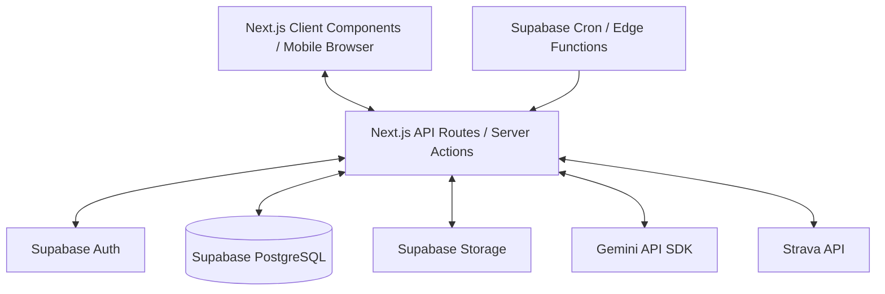

# ARCHITECTURE.md: Fat2Fit Järjestelmäarkkitehtuuri

Tämä dokumentti kuvaa Fat2Fit-sovelluksen teknisen arkkitehtuurin ja palveluiden väliset suhteet.

## 1. Yleisarkkitehtuuri
Fat2Fit on rakennettu modernilla full-stack TypeScript -arkkitehtuurilla käyttäen Next.js-kehystä (App Router) ja Supabase-pilvipalvelua.

## 2. Rakenneosat
### 2.1 Frontend (React & Next.js App Router)
* **Server Components**: Käytetään oletuksena tietojen hakuun ja sivujen alustukseen (SEO-ystävällinen, nopea lataus, suora tietokantayhteys ilman turhia client-kutsuja).
* **Client Components**: Käytetään interaktiivisissa osissa, kuten chat-ikkunassa, aterioiden kirjauslomakkeissa, kaavioissa ja valokuvauksen hallinnassa.
* **State Management**: Reactin paikallinen tila (useState/useReducer) ja tarvittaessa React Context API. Ei tarvetta raskaille tilanhallintakirjastoille (kuten Redux).

### 2.2 Backend (Next.js Route Handlers)
* **API-reitit**:
  - `/api/integrations/strava/*` - Stravan OAuth ja webhook-käsittelijät.
  - `/api/nutrition/analyze` - Ruokakuvien vastaanotto, tallennus Storageen ja analyysikutsut Geminiin.
  - `/api/chat` - Chatbotin Gemini-rajapinta.
  - `/api/reminders` - Muistutusten Web Push -lähetykset.

### 2.3 Tietokanta ja Käyttäjähallinta (Supabase)
* **PostgreSQL**: Kaikki relaatiotieto, asetukset, lokit ja tavoitteet tallennetaan Supabasen hallinnoimaan PostgreSQL-tietokantaan.
* **Row Level Security (RLS)**: Jokaisessa taulussa on `user_id`-kenttä. RLS-säännöt varmistavat, että käyttäjä pääsee käsiksi ainoastaan omiin tietoihinsa.
* **Storage**: Käyttäjän lataamat ruokakuvat ja Garmin-tiedostot tallennetaan yksityisiin tallennuskoreihin (Storage Buckets). Kuvien lataaminen selaimelle suojataan lyhytikäisillä allekirjoitetuilla URL-osoitteilla.
* **Cron**: Automaattiset muistutukset ja viikkoraporttien koosteet ajetaan hyödyntäen Supabase pg_net / pg_cron -laajennuksia tai Vercel Cronia.

### 2.4 Tekoälykerros (Gemini API)
* Sovellus kommunikoi suoraan virallisen Google GenAI SDK:n (`@google/genai`) kautta Gemini-mallien (esim. `gemini-1.5-flash` kuvien analysointiin ja nopeaan chattiin, `gemini-1.5-pro` monimutkaiseen päättelyyn) kanssa.
* Kaikki tekoälyn palauttamat JSON-rakenteet (Structured Outputs) validoidaan Zod-skeemoilla ennen tallentamista tai laskentaan viemistä.

### 2.5 Integraatiokerros (OAuth & Webhooks)
* **Strava API**: OAuth 2.0 -käyttöoikeustunnukset (Access ja Refresh Tokenit) tallennetaan tietokantaan suojattuna (salattuina). Webhook-reitti käsittelee reaaliaikaiset suoritukset ja sovittaa ne suunniteltuihin treeneihin.
* **Garmin Provider**: Yhteinen `HealthDataProvider`-rajapinta mahdollistaa manuaalisen CSV-tuonnin, FIT-tiedostojen parsinnan ja helpon laajennettavuuden viralliseen Garmin Health API:iin tulevaisuudessa.
