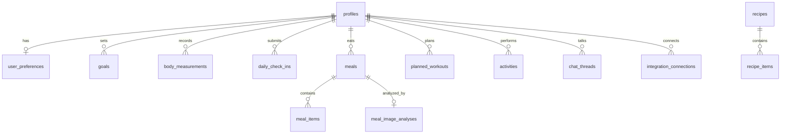

# DATA_MODEL.md: Fat2Fit Tietokantamalli

Tämä dokumentti kuvaa sovelluksen PostgreSQL-tietokantataulut, suhteet, indeksit ja Row Level Security (RLS) -periaatteet.

## 1. Yleiset periaatteet
1. Jokaisessa käyttäjäkohtaisessa taulussa on `user_id uuid REFERENCES auth.users(id) ON DELETE CASCADE`.
2. Jokaisessa taulussa on `id uuid PRIMARY KEY DEFAULT gen_random_uuid()`, `created_at timestamptz DEFAULT now()` ja `updated_at timestamptz DEFAULT now()`.
3. Tekoälyn tai laskennan tuottamissa kentissä on aina mukana metadata: `source`, `confidence`, `model_name`, `model_version` ja `input_data_hash`.
4. RLS (Row Level Security) on otettu käyttöön jokaisessa taulussa:
   ```sql
   ALTER TABLE table_name ENABLE ROW LEVEL SECURITY;
   CREATE POLICY user_policy ON table_name 
     USING (auth.uid() = user_id) 
     WITH CHECK (auth.uid() = user_id);
   ```

## 2. Relaatiomalli ja Taulukuvaukset



### 2.1 Käyttäjät ja Asetukset
* **`profiles`**
  - `id` (uuid, PK, references auth.users)
  - `display_name` (text)
  - `birth_year` (int)
  - `height_cm` (numeric)
  - `gender` (text) - *fysiologinen profiili laskentaan*
  - `timezone` (text, default 'Europe/Helsinki')
* **`user_preferences`**
  - `user_id` (uuid, FK, unique)
  - `wake_up_time` (time)
  - `bed_time` (time)
  - `coaching_style` (text[]) - *lempeä, analyyttinen, jne.*
  - `nutrition_style` (text) - *joustava, tarkka*
  - `dietary_restrictions` (text[])
* **`notification_preferences`**
  - `user_id` (uuid, FK, unique)
  - `push_enabled` (boolean)
  - `morning_checkin_reminder` (time)
  - `meal_reminders_enabled` (boolean)
  - `bedtime_reminder` (time)

### 2.2 Tavoitteet
* **`goals`**
  - `id` (uuid, PK)
  - `user_id` (uuid, FK)
  - `primary_objective` (text) - *weight_loss, body_recomposition, etc.*
  - `primary_objective_label` (text)
  - `status` (text) - *active, completed, archived*
  - `start_date` (date)
  - `target_date` (date)
* **`goal_versions`**
  - `id` (uuid, PK)
  - `goal_id` (uuid, FK)
  - `version` (int)
  - `target_weight_kg` (numeric)
  - `target_body_fat_pct` (numeric)
  - `target_muscle_mass_kg` (numeric)
  - `weekly_exercise_count_target` (int)
  - `change_reason` (text)
  - `changed_at` (timestamptz)
  - `changed_by` (text) - *user, chatbot*

### 2.3 Mittaukset
* **`body_measurements`**
  - `id` (uuid, PK)
  - `user_id` (uuid, FK)
  - `measured_at` (timestamptz)
  - `metric` (text) - *weight, body_fat_pct, muscle_mass_kg, waist_cm*
  - `value` (numeric)
  - `source` (text) - *manual, chat, garmin, csv_import, image_extraction*
  - `user_confirmed` (boolean)
  - `confidence` (numeric)
* **`daily_check_ins`**
  - `id` (uuid, PK)
  - `user_id` (uuid, FK)
  - `date` (date)
  - `sleep_hours` (numeric)
  - `sleep_quality` (int) - *1-5*
  - `energy_level` (int) - *1-5*
  - `stress_level` (int) - *1-5*
  - `soreness_level` (int) - *1-5*
  - `hunger_level` (int) - *1-5*
  - `notes` (text)

### 2.4 Ravinto
* **`food_reference_cache`** (Fineli-tietokanta)
  - `id` (text, PK) - *Fineli-elintarviketunnus*
  - `name_fi` (text)
  - `name_en` (text)
  - `energy_kcal` (numeric)
  - `protein_g` (numeric)
  - `carbohydrates_g` (numeric)
  - `fat_g` (numeric)
  - `fiber_g` (numeric)
  - *Indeksi `name_fi` kentälle tekstihakuja varten (pg_trgm).*
* **`meals`**
  - `id` (uuid, PK)
  - `user_id` (uuid, FK)
  - `logged_at` (timestamptz)
  - `meal_type` (text) - *breakfast, lunch, dinner, snack*
  - `accuracy_class` (text) - *WEIGHED, PHOTO_ESTIMATE, etc.*
* **`meal_items`**
  - `id` (uuid, PK)
  - `meal_id` (uuid, FK)
  - `food_id` (text) - *viittaus food_reference_cache tai custom_foods*
  - `food_name` (text)
  - `amount_g` (numeric)
  - `energy_kcal` (numeric)
  - `protein_g` (numeric)
  - `carbohydrates_g` (numeric)
  - `fat_g` (numeric)
  - `fiber_g` (numeric)
* **`meal_image_analyses`**
  - `id` (uuid, PK)
  - `meal_id` (uuid, FK)
  - `image_url` (text)
  - `detected_payload` (jsonb)
  - `model_name` (text)
  - `confidence` (numeric)

### 2.5 Liikunta ja Suunnittelu
* **`planned_workouts`**
  - `id` (uuid, PK)
  - `user_id` (uuid, FK)
  - `date` (date)
  - `activity_type` (text)
  - `title` (text)
  - `duration_minutes` (int)
  - `intensity` (text) - *recovery, easy, moderate, hard, very_hard*
  - `status` (text) - *planned, completed, skipped, moved*
  - `locked_by_user` (boolean)
* **`activities`** (Toteutuneet)
  - `id` (uuid, PK)
  - `user_id` (uuid, FK)
  - `provider` (text) - *strava, garmin, manual*
  - `external_id` (text)
  - `activity_type` (text)
  - `started_at` (timestamptz)
  - `duration_seconds` (int)
  - `distance_meters` (numeric)
  - `calories_kcal` (numeric)
  - `average_heart_rate` (numeric)
  - `perceived_exertion` (int) - *RPE 1-10*

### 2.6 Suunnitelman mukautukset ja Chat
* **`plan_adjustments`**
  - `id` (uuid, PK)
  - `user_id` (uuid, FK)
  - `applied_at` (timestamptz)
  - `reason_code` (text) - *LOW_SLEEP, MISSED_WORKOUT, etc.*
  - `description` (text)
  - `is_undone` (boolean, default false)
* **`chat_threads`**
  - `id` (uuid, PK)
  - `user_id` (uuid, FK)
  - `title` (text)
* **`chat_messages`**
  - `id` (uuid, PK)
  - `thread_id` (uuid, FK)
  - `role` (text) - *user, assistant, system*
  - `content` (text)
  - `tool_calls` (jsonb)

## 3. Indeksit ja Suorituskyky
Optimoidaan hakuja luomalla seuraavat indeksit:
* `CREATE INDEX idx_body_measurements_user_date ON body_measurements(user_id, measured_at DESC);`
* `CREATE INDEX idx_meals_user_date ON meals(user_id, logged_at DESC);`
* `CREATE INDEX idx_activities_user_date ON activities(user_id, started_at DESC);`
* `CREATE INDEX idx_planned_workouts_user_date ON planned_workouts(user_id, date);`
* `CREATE INDEX idx_fineli_name_trgm ON food_reference_cache USING gin (name_fi gin_trgm_ops);` - *Nopeat suomenkieliset tuotehaut.*
